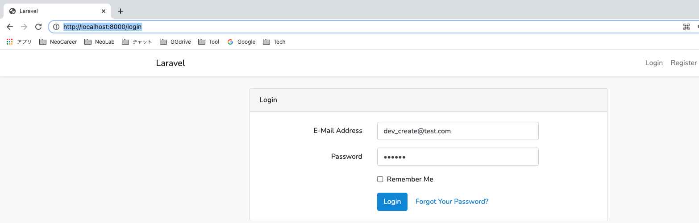

# Vue2 Laravel8 Docker permission & role 🚀🐳


## create project
1. `composer create-project --prefer-dist laravel/laravel role_permission_vue`
2. `npm i`
3. `npm i vue-router`
4. install auth: hien goc tren phai "login, register"
```shell
composer require laravel/ui
php artisan ui vue --auth
php artisan migrate
```
>5. if has ERR with docker's MySQL container: `SQLSTATE[HY000] [2054] The server requested authentication method unknown to the client`
>- `infra/mysql/my.cnf`:
```shell
[mysqld]
default_authentication_plugin=mysql_native_password
```
>- `docker-compose up -d --build`

## db (need use a db container)
1. `.env`:
```sql
DB_HOST=127.0.0.1
DB_PORT=33060
```
2. `php artisan make:model Permission/Role -m`
3. `php artisan make:migration create_users_permissions<roles>_table --create=users_permissions<roles>`


4. `php artisan migrate`
5. `php artisan make:seeder Permission<Role><User>TableSeeder`
6. `php artisan migrate:refresh --seed`
7. check by tinker: `php artisan tinker`
- 7-1.
```sql
>>> DB::select('select 1');
=> [
     {#3046
       +"1": 1,
     },
   ] // -> OK!
```
- 7-2.
```sql
>>> DB::connection()->getConfig();
=> [
     "driver" => "mysql",
     "host" => "127.0.0.1",
     "port" => "33060",
     "database" => "laravel_local",
     "username" => "root",
     "password" => "secret",
     "unix_socket" => "",
     "charset" => "utf8mb4",
     "collation" => "utf8mb4_unicode_ci",
     "prefix" => "",
     "prefix_indexes" => true,
     "strict" => true,
     "engine" => null,
     "options" => [],
     "name" => "mysql",
   ]
```
- 7-3.
```sql
>>> DB::connection()->getPdo();
=> PDO {#1035
     inTransaction: false,
     attributes: {
       CASE: NATURAL,
       ERRMODE: EXCEPTION,
       AUTOCOMMIT: 1,
       PERSISTENT: false,
       DRIVER_NAME: "mysql",
       SERVER_INFO: "Uptime: 561  Threads: 4  Questions: 137  Slow queries: 0  Opens: 178  Flush tables: 3  Open tables: 97  Queries per second avg: 0.244",
       ORACLE_NULLS: NATURAL,
       CLIENT_VERSION: "mysqlnd 5.0.12-dev - 20150407 - $Id: 7cc7cc96e675f6d72e5cf0f267f48e167c2abb23 $",
       SERVER_VERSION: "8.0.25",
       STATEMENT_CLASS: [
         "PDOStatement",
       ],
       EMULATE_PREPARES: 0,
       CONNECTION_STATUS: "127.0.0.1 via TCP/IP",
       DEFAULT_FETCH_MODE: BOTH,
     },
   }
```

## mvc
1. `php artisan make:provider PermissionsServiceProvider`
2. `php artisan make:model Task -m`
3. `php artisan make:controller TaskController --resource`
4. `php artisan make:controller UserController`
5. `php artisan migrate`

## deploy local
1. `composer install`
2. copy from `.env.example` to `.env`
3. `php artisan serve`
4. `npm i & npm run watch`
5. test by 5 accs: `database/seeders/UserTableSeeder.php`
- `dev_create@test.com, dev_delete@test.com, dev_full@test.com, manager@test.com, manager1@test.com`
- login by `dev_create@test.com`



- login by `manager@test.com`


4. test by dd: `routes/web.php: dd($user->can('create-tasks'));`
- access browser `http://localhost:8000/userpage`


## heroku (NO need `.env`)


1. `heroku create hrk-permission-role-dotq`
2. heroku dashboard: APP_DEBUG=true
3. `heroku config:set APP_KEY=$(php artisan --no-ansi key:generate --show)`
4. `heroku addons:create heroku-postgresql:hobby-dev` -> heroku dashboard: auto create `DATABASE_URL`
5. `heroku run php artisan migrate:refresh --seed`
6.
```shell
git add .
git commit -m update
git push heroku main
```

## reference
[viblo](https://viblo.asia/p/phan-quyen-user-voi-laravel-va-vue-router-WAyK8p0mKxX)

